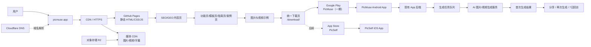
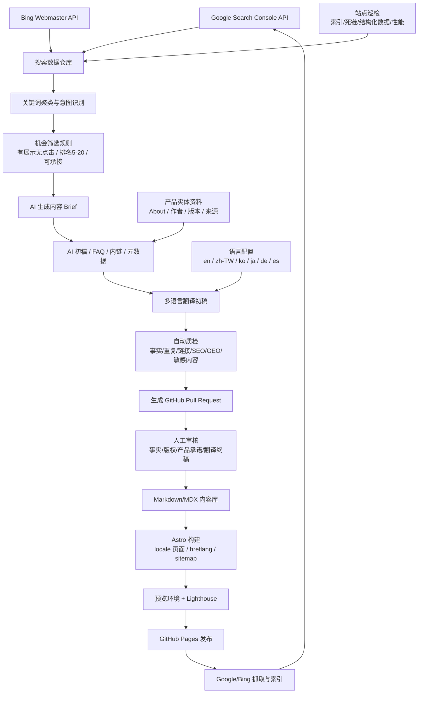
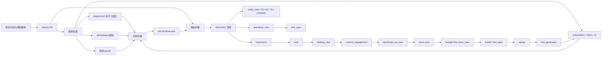
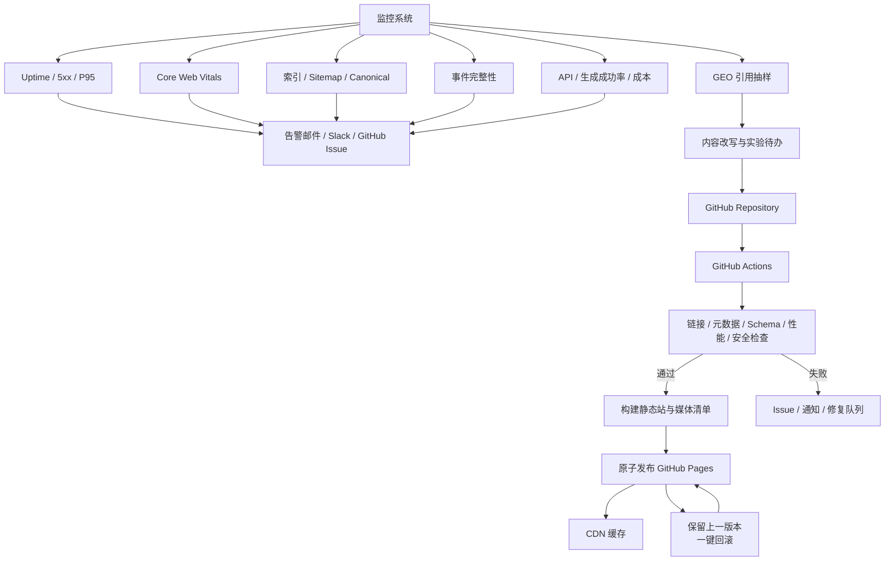

# PicMuse SEO / GEO 全链路流程图

## 一、总体架构与用户访问链路

## 二、多语言内容与 SEO/GEO 自动化链路

## 三、内容发布、媒体处理与转化漏斗

## 四、部署、监控与回滚

## 五、职责边界

| 模块 | 主要职责 | 是否需要常驻服务器 |
|---|---|---|
| GitHub Repository | 代码、内容、媒体清单、版本记录 | 否 |
| GitHub Actions | 构建、质检、媒体处理、自动 PR | 否 |
| GitHub Pages/CDN | 静态页面和公开资源分发 | 否 |
| 对象存储 | 图片、视频、字幕、封面 | 否 |
| 独立 API | 登录、配额、生成、分享、动态数据 | 是，可用 serverless/托管服务 |
| 数据仓库/看板 | Search Console、漏斗、成本、告警 | 通常使用托管服务 |
